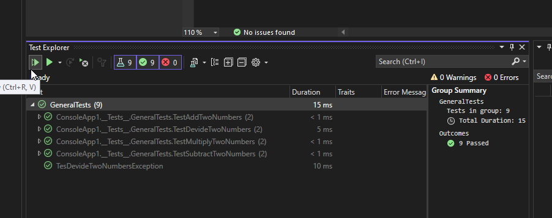
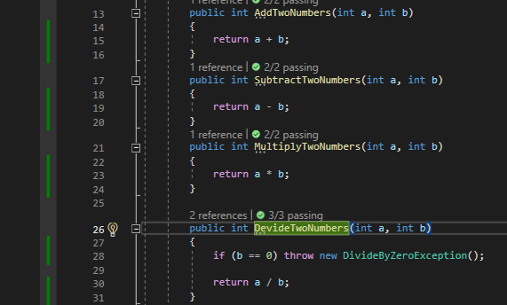
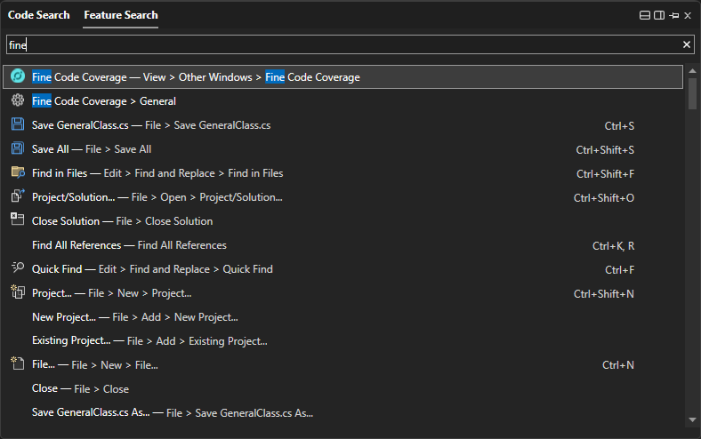
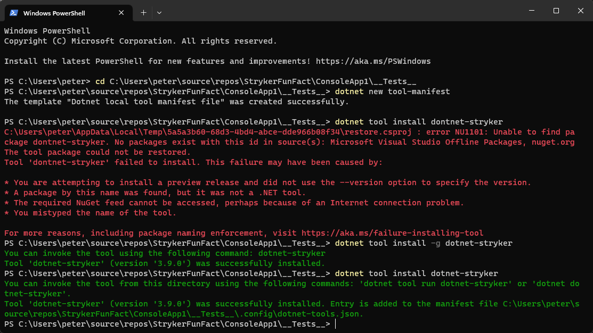
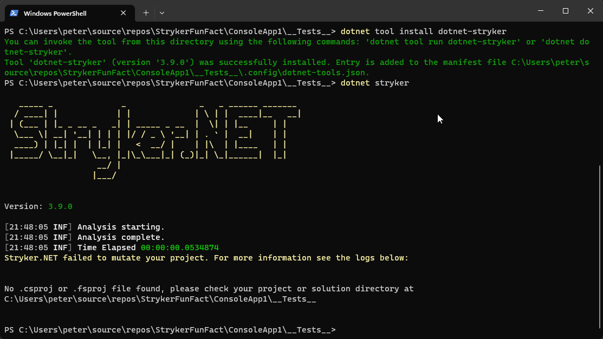

open in vs code

press Shift + CTL + V (for reader view)

install this 

fine code covarage is a free tool to get your code coverage without the need for an enterprise licence 

https://marketplace.visualstudio.com/items?itemName=FortuneNgwenya.FineCodeCoverage2022
https://www.youtube.com/watch?v=Rae5bTE2D3o

then open the solution

run tests

green lines on the side show covered code
yellow is partially covered
red is uncovered
(takes a second to load up)

open fine code coverage page

should look line this

Prove code coverage is good

open powershell

navigate to 
./ConsoleApp1/__Tests__

install
run this > `dotnet tool install -g dotnet-stryker`
run this > `dotnet new tool-manifest`
run this > `dotnet tool install dotnet-stryker`

running
run this to run stryker > `dotnet stryker`

https://www.youtube.com/watch?v=sGwfwtkaDfk